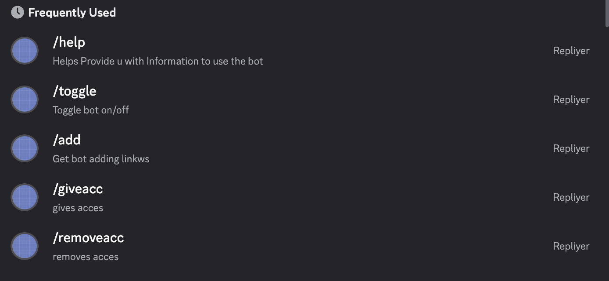

# REPLIYER

A Discord AI powered bot running through Hugging Face's Inteference Api, with per-server configurations, access and revocation commands, and management.

# SETUP

1.  Will require [python](https://www.python.org/downloads/)

2.  Clone The Repo 
 ```bash
    git clone https://github.com/chaitanya44444/Repliyer-Bot.git```

3.  Install Packages
```bash
    pip install -r requirements.txt
```

4.  Environment Variables

    To run this project, you will need to add the following environment variables to your .env file
    - Get ur discord bot token from -https://discord.com/developers/home
    -Get ur Hugging Face apikey from https://huggingface.co/settings/tokens

    ```
        discordtoken=token
        hf_api=apikey
    ```

5.  Running The Bot
    ```python main.py```

# Usage
    You simply mention the bot and it will reply unless configured otherwise.

# COMMANDS
    /help -Gives a detailed help guide
    /configcustom -Setups up a configuration for specific ai model -requires hugginface api key and modelname
    /configdefault- Makes server go back to default configuration
    /giveacc- Gives acces in server to let sm1 Talk to ai
    /removeacc -Removes Acesss
    /Toggle -Toggles ai on and off
    /add - Gives link to add to server invite for bot
# Context Menu Functions
    - Simply right click on a user and u can:

## Features

    - AI Chat
    - Per server Model Configuration
    - Toggling server ai
    - User Access Control
    - Conversation history


## Demo

    https://discord.gg/x4E59MvzH



## Contributing

Contributions are always welcome!


